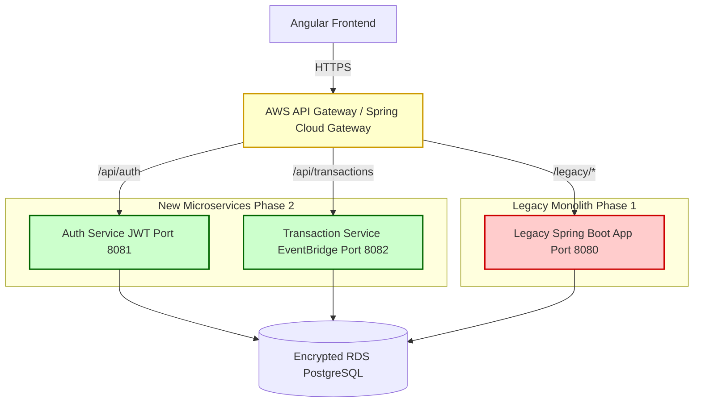

# Secure Legacy Modernization: Strangler Pattern Implementation for FedRAMP Environments

> **Project Goal:** Demonstrate a secure, incremental migration of a mission-critical legacy monolith to a cloud-native microservices architecture on AWS, adhering to FedRAMP High compliance principles.

## 🏗️ Architecture Overview

This project simulates the **"Strangler Fig" pattern**, where specific functionalities (Authentication, Transactions) are gradually extracted from a legacy Java monolith into independent Spring Boot microservices. Traffic is routed via an API Gateway, allowing for zero-downtime migration.

### High-Level Architecture Diagram

The diagram below illustrates the traffic flow from the Angular Frontend through the API Gateway, splitting between the **Legacy Monolith** (Phase 1) and the **New Microservices** (Phase 2).




🔒 Security & Compliance (FedRAMP Simulation)

This implementation prioritizes security controls required for high-assurance environments:

    Identity & Access Management (IAM):
        Strict Least Privilege roles defined in infra/terraform.
        JWT-based stateless authentication with short-lived tokens.
    Data Protection:
        Encryption at Rest: Simulated via AWS KMS (Parameter Store) for secrets.
        Encryption in Transit: All internal and external communication enforced via HTTPS/TLS 1.3.
    Audit & Observability:
        Centralized Logging: Structured JSON logs sent to a simulated CloudWatch endpoint.
        Audit Trails: Every API request is logged with timestamp, user ID, and action (simulating FISMA requirements).
        Vulnerability Scanning: CI/CD pipeline includes Trivy for container image scanning.

🛠️ Tech Stack

    Backend: Java 21, Spring Boot 4.x, Spring Cloud Gateway
    Frontend: Angular 17+ (Demonstrating specific framework proficiency)
    Infrastructure: Docker, Docker Compose, Terraform (IaC)
    Database: PostgreSQL (Simulating RDS/Aurora)
    CI/CD: GitHub Actions (Simulating GitLab CI/CD)
    Patterns: Strangler Fig, Event-Driven Architecture, Circuit Breaker

🚀 Getting Started (Local Simulation)

This project runs entirely in Docker to simulate the AWS GovCloud environment locally.
Prerequisites

    Docker & Docker Compose
    Java 21 (for local dev)
    Node.js 18+ (for Angular dev)

Run the Simulation

    Clone the repository:

    git clone https://github.com/pclumson/fedramp-monolith-migration-simulator.git
    cd fedramp-monolith-migration-simulator

    Start the environment:

    docker-compose up --build

    Access the Services:
        Angular Dashboard: http://localhost:4200
        API Gateway: http://localhost:8080
        Legacy Monolith Health: http://localhost:8080/legacy/actuator/health
        Auth Service Health: http://localhost:8081/actuator/health

📂 Project Structure
Directory	Description
/legacy-app	The original monolithic Spring Boot application (Phase 1).
/services/auth-service	Extracted microservice handling identity (Phase 2).
/services/transaction-service	Async transaction processor using EventBridge patterns.
/services/api-gateway	Spring Cloud Gateway implementing the Strangler routing logic.
/angular-frontend	Angular dashboard demonstrating micro-frontend routing.
/infra	Terraform scripts defining AWS GovCloud resources (IAM, VPC, RDS).
🔄 Migration Strategy (Strangler Pattern)

    Phase 1: All traffic routes to the legacy-app.
    Phase 2: The Gateway intercepts /api/auth and routes it to the new auth-service.
    Phase 3: The Gateway intercepts /api/transactions and routes it to transaction-service.
    Phase 4: Once all modules are migrated, the legacy-app is decommissioned.

🤝 Contributing & Feedback

This project serves as a reference implementation for enterprise modernization. Feedback on security patterns or architectural decisions is welcome.

## Current Files structure


Built with ❤️ by Prince Clumson-Eklu | Senior Full Stack Engineer


---

### 3. The `docker-compose.yml`
This file spins up the database, the legacy app, the new microservices, and the gateway.

```yaml
